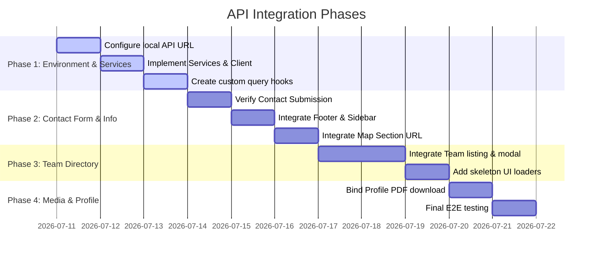

# Rimal Frontend Codebase Analysis & API Integration Roadmap

This document provides a comprehensive analysis of the frontend codebase of the **RIMAL Trading Group** digital presence website. The goal is to fully understand the frontend architecture, state management, routing, and static data distribution before integrating the completed backend APIs.

---

## 1. Project Architecture

The application is built as a modern, high-performance, single-page application (SPA).

### Core Tech Stack:
*   **Framework**: React 18.3.1 (Vite-based build system, Bun runtime configuration).
*   **Routing**: React Router DOM v6.30.1.
*   **Data Fetching & Server State**: TanStack React Query v5.83.0.
*   **HTTP Client**: Axios 1.18.1.
*   **Form Management & Validation**: React Hook Form v7.80.0, Zod v4.4.3, and Hook Form Resolvers.
*   **Styling**: Tailwind CSS v3.4.17 with Tailwindcss-Animate, Class Variance Authority, Clsx, and Tailwind-Merge.
*   **Animations**: Framer Motion v12.34.0.
*   **Scroll Mechanics**: Lenis v1.3.17 (smooth inertia-based scrolling).
*   **UI Components & Toasts**: Radix UI (Dialog, Tooltip) and Sonner (toasts).
*   **Testing**: Vitest v3.2.4 (configured but unused in source code).
*   **Code Quality**: TypeScript v5.8.3, ESLint v9.32.0.

### Architecture Patterns:
*   **Decoupled Services**: HTTP configuration is isolated in an Axios client, and endpoint calls are abstracted in service files under `src/services/`.
*   **Component-Driven Development**: The app is divided into layouts, custom UI components, generic blocks, and page-specific sections.
*   **Declarative Layout Wrapping**: Layout components (Header + Footer) wrapper is directly rendered inside page templates.
*   **Declarative Validations**: Validation logic is extracted into schema files under `src/schemas/`.

---

## 2. Folder Structure

The directory is structured using a feature-based and layer-based separation of concerns:

```
rimal-digital-presence/
├── public/                     # Static public assets (favicons, etc.)
├── src/
│   ├── assets/                 # Local images, icons, and documents
│   │   ├── Icons/              # Social media icons (LinkedIn, Twitter, etc.)
│   │   ├── Profile PDF/        # Statically served corporate profile PDF
│   │   ├── Team/               # Statically imported team photos (WebP format)
│   │   ├── Logo.webp           # Main RIMAL brand logo
│   │   └── ...                 # Miscellaneous illustration assets
│   ├── components/             # Reusable UI elements and page blocks
│   │   ├── common/             # Generic layout blocks
│   │   │   └── PageHero.tsx    # Scroll-linked parallax page hero banner
│   │   ├── sections/           # Section-specific parts (imported in pages)
│   │   ├── ui/                 # Small atomic elements (sonner.tsx, tooltip.tsx)
│   │   │   └── use-toast.ts    # Unused placeholder hook file
│   │   ├── Footer.tsx          # Global Footer component
│   │   ├── Header.tsx          # Global Header (Navbar) component
│   │   ├── Layout.tsx          # Wrapper layout injects Header & Footer
│   │   ├── ProfileModal.tsx    # Modal displaying selected team member profile details
│   │   └── ScrollToTop.tsx     # Handler for scroll-to-top on route change
│   ├── data/                   # Hardcoded mock datasets (company, team)
│   │   ├── company.ts          # Static company metadata, description, values
│   │   └── team.ts             # Static team members metadata array
│   ├── hooks/                  # Custom React hooks
│   │   └── useLenis.ts         # Hook wrapper for Lenis smooth-scrolling methods
│   ├── lib/                    # Library-specific helpers
│   │   ├── animations.ts       # Shared Framer Motion animation variants
│   │   └── utils.ts            # Tailwind Classname merger utility
│   ├── pages/                  # Page-level route views (Index, About, etc.)
│   │   ├── Index.tsx           # Homepage composition
│   │   ├── About.tsx           # About page composition
│   │   ├── Businesses.tsx      # Businesses sectors and markets overview page
│   │   ├── Leadership.tsx      # Core values and team page
│   │   ├── Contact.tsx         # Get-in-touch page (form + map)
│   │   └── NotFound.tsx        # 404 fallback page
│   ├── providers/              # React Context Providers
│   │   └── LenisProvider.tsx   # Provider initializing and wiring Lenis
│   ├── schemas/                # Form validation schemas
│   │   └── contactSchema.ts    # Zod validation schema for contact inquiry forms
│   ├── services/               # API clients and actions
│   │   ├── httpClient.ts       # Base Axios instance and client wrapper
│   │   └── contactService.ts   # Contact API endpoint wrapper
│   ├── types/                  # Shared TypeScript type definitions
│   │   └── profile.ts          # Type definition for team member details
│   ├── App.tsx                 # Root component with routing and providers
│   ├── main.tsx                # Client entry point
│   └── index.css               # Global Tailwind CSS styles and brand tokens
```

---

## 3. Routing

The routing architecture is set up in [App.tsx](file:///d:/Business/Switch/work/Remal/rimal-digital-presence-main/src/App.tsx) using `react-router-dom`:

*   **BrowserRouter**: Client-side routing helper.
*   **Lazy Loading / Code Splitting**: All primary pages are split at the build level using `React.lazy` and wrapped in a `<Suspense>` boundary to optimize initial load times.
*   **Scroll Management**: `<ScrollToTop />` listens to pathname changes and scrolls the page back to index 0 smoothly.

### Route Map:
| Path | Component | Description | Lazy Loaded |
| :--- | :--- | :--- | :--- |
| `/` | `Index` ([Index.tsx](file:///d:/Business/Switch/work/Remal/rimal-digital-presence-main/src/pages/Index.tsx)) | Homepage showcasing hero, short bio, team preview, and CTA. | Yes |
| `/about` | `About` ([About.tsx](file:///d:/Business/Switch/work/Remal/rimal-digital-presence-main/src/pages/About.tsx)) | Detailed company heritage, CEO message, mission & vision, culture. | Yes |
| `/businesses` | `Businesses` ([Businesses.tsx](file:///d:/Business/Switch/work/Remal/rimal-digital-presence-main/src/pages/Businesses.tsx)) | Overview of capabilities, sectors, and target markets. | Yes |
| `/leadership` | `Leadership` ([Leadership.tsx](file:///d:/Business/Switch/work/Remal/rimal-digital-presence-main/src/pages/Leadership.tsx)) | Rimal's leadership principles, core values, and team directory. | Yes |
| `/contact` | `Contact` ([Contact.tsx](file:///d:/Business/Switch/work/Remal/rimal-digital-presence-main/src/pages/Contact.tsx)) | Get-in-touch interface with input form and interactive map. | Yes |
| `*` | `NotFound` ([NotFound.tsx](file:///d:/Business/Switch/work/Remal/rimal-digital-presence-main/src/pages/NotFound.tsx)) | Custom 404 page logging and displaying redirection button. | Yes |

> [!WARNING]
> In [HeroSection.tsx](file:///d:/Business/Switch/work/Remal/rimal-digital-presence-main/src/components/sections/HeroSection.tsx) (line 76), the "Explore Partnership" button links to `/partners`, which is **not** a defined route in `App.tsx` (causing a 404 error if clicked). During integration, this link should be updated to target `/contact` or `/about` based on business needs.

---

## 4. State Management

The application is lightweight and does not utilize a heavy global state library like Redux or Zustand. State flows naturally through:

1.  **Static Imports (Read-Only Data Flow)**: Statically declared arrays and objects (`siteContent`, `leadership`) are imported directly by components that need them from the `data/` folder.
2.  **Server State (React Query)**: Abstracted queries and mutations. Currently initialized via `QueryClientProvider` in `App.tsx` and used exclusively in [ContactFormSection.tsx](file:///d:/Business/Switch/work/Remal/rimal-digital-presence-main/src/components/sections/ContactFormSection.tsx) for submitting data via a React Query mutation.
3.  **Local UI State (`useState`)**: Used for transient UI concerns:
    *   Mobile navigation menu toggle status (`mobileOpen` in `Header.tsx`).
    *   Sticky scroll trigger status (`scrolled` in `Header.tsx`).
    *   Selected team member object (`selectedMember` in `TeamSection.tsx` passed to `ProfileModal`).
    *   Map iframe load tracker (`isLoading` in `ContactMapSection.tsx` to handle custom animated loader visibility).
4.  **URL State**: `useLocation()` is consumed to highlight current navigation markers in `Header.tsx` and track 404 targets in `NotFound.tsx`.

---

## 5. UI Component Tree

The structural hierarchy of the frontend is illustrated below:

```mermaid
graph TD
    App[App.tsx] --> LP[LenisProvider]
    LP --> QP[QueryClientProvider]
    QP --> TP[TooltipProvider]
    TP --> S[Sonner Toaster]
    TP --> BR[BrowserRouter]
    BR --> STT[ScrollToTop]
    BR --> Suspense[Suspense Boundary]
    
    Suspense --> PageRoutes{Routes}
    
    %% Index Page
    PageRoutes -->|/| Index[pages/Index.tsx]
    Index --> L_Index[Layout]
    L_Index --> H_Index[Header]
    L_Index --> F_Index[Footer]
    L_Index --> HS[HeroSection]
    L_Index --> AS[AboutSection]
    L_Index --> WP[WhyPartnerWithRimal]
    L_Index --> C5[Cards5 - Sectors]
    L_Index --> WMD[WhatMakesUsDifferent]
    L_Index --> TS_Index[TeamSection]
    TS_Index --> PM_Index[ProfileModal]
    L_Index --> QS[QuoteSection]
    L_Index --> FC[FinalCTA]

    %% About Page
    PageRoutes -->|/about| About[pages/About.tsx]
    About --> L_About[Layout]
    L_About --> H_About[Header]
    L_About --> F_About[Footer]
    L_About --> AHS[AboutHeroSection] --> PH_A[PageHero]
    L_About --> ANS[AboutNameSection]
    L_About --> ACS[AboutCEOSection]
    L_About --> AMV[AboutMissionVisionSection]
    L_About --> AIS[AboutImageSection]
    L_About --> ACC[AboutCultureSection]

    %% Businesses Page
    PageRoutes -->|/businesses| Businesses[pages/Businesses.tsx]
    Businesses --> L_Bus[Layout]
    L_Bus --> H_Bus[Header]
    L_Bus --> F_Bus[Footer]
    L_Bus --> BHS[BusinessesHeroSection] --> PH_B[PageHero]
    L_Bus --> BSS[BusinessesSectorsSection]
    L_Bus --> BMS[BusinessesMarketsSection]
    L_Bus --> BPS[BusinessesPositionSection]

    %% Leadership Page
    PageRoutes -->|/leadership| Leadership[pages/Leadership.tsx]
    Leadership --> L_Lead[Layout]
    L_Lead --> H_Lead[Header]
    L_Lead --> F_Lead[Footer]
    L_Lead --> LHS[LeadershipHeroSection] --> PH_L[PageHero]
    L_Lead --> LPS[LeadershipPrinciplesSection]
    L_Lead --> LQS[LeadershipQuoteSection]
    L_Lead --> TS_Lead[TeamSection]
    TS_Lead --> PM_Lead[ProfileModal]
    L_Lead --> LFP[LeadershipFuturePlansSection]

    %% Contact Page
    PageRoutes -->|/contact| Contact[pages/Contact.tsx]
    Contact --> L_Con[Layout]
    L_Con --> H_Con[Header]
    L_Con --> F_Con[Footer]
    L_Con --> CHS[ContactHeroSection] --> PH_C[PageHero]
    L_Con --> CFS[ContactFormSection]
    L_Con --> CMS[ContactMapSection]
```



---

## 6. Static Data Inventory

Below is an inventory of every file and constant containing hardcoded site content that should ideally be driven by the backend APIs or unified configuration:

| File | Constant / Array | Data Described | Consumed By | Status / Integration Mapping |
| :--- | :--- | :--- | :--- | :--- |
| [company.ts](file:///d:/Business/Switch/work/Remal/rimal-digital-presence-main/src/data/company.ts) | `siteContent.company` | Company name, short name, tagline, email, telephone numbers, physical address, social link handles. | `ContactFormSection.tsx`<br>`Footer.tsx` | **To be replaced by `GET /contact-info`**. Phone numbers, emails, and address are available on this endpoint. |
| [company.ts](file:///d:/Business/Switch/work/Remal/rimal-digital-presence-main/src/data/company.ts) | `siteContent.about` | Long bio text, company mission & vision statements, and values bullet list. | `AboutNameSection.tsx`<br>`AboutMissionVisionSection.tsx` | **Unmapped in API**. The backend API does not currently offer a company bio/mission endpoint; these should remain static or be integrated if corporate info models expand. |
| [company.ts](file:///d:/Business/Switch/work/Remal/rimal-digital-presence-main/src/data/company.ts) | `siteContent.stats` | Numbers indicating experience, active sectors, and partners. | `AboutSection.tsx` | **Commented Out in UI**. Handled in JSX but commented out. |
| [company.ts](file:///d:/Business/Switch/work/Remal/rimal-digital-presence-main/src/data/company.ts) | `siteContent.values` | Core values list (Proven Leadership, Strategic Growth, etc.). | `WhyRimalSection.tsx` | **Dead Page Section**. `WhyRimalSection` is not imported or rendered by any page in `src/pages/`. |
| [company.ts](file:///d:/Business/Switch/work/Remal/rimal-digital-presence-main/src/data/company.ts) | `siteContent.markets` | Primary, secondary, and global target segments. | `BusinessesMarketsSection.tsx` | **Unmapped in API**. These describe corporate markets and targets; must remain static unless a new endpoint is provided. |
| [company.ts](file:///d:/Business/Switch/work/Remal/rimal-digital-presence-main/src/data/company.ts) | `siteContent.footerTagline` | Tagline text in the footer. | `Footer.tsx` | Can remain static or map to corporate profile metadata if supported. |
| [team.ts](file:///d:/Business/Switch/work/Remal/rimal-digital-presence-main/src/data/team.ts) | `leadership` | List of 4 team members containing name, department, role, email, profile descriptions, expertise list, LinkedIn link, and locally imported WebP pictures. | `TeamSection.tsx` | **To be replaced by `GET /team`**. Fully supported by the backend API. |
| [AboutCEOSection.tsx](file:///d:/Business/Switch/work/Remal/rimal-digital-presence-main/src/components/sections/AboutCEOSection.tsx) | `ceoMessage` | 3 paragraphs message from the founder & CEO. | `AboutCEOSection.tsx` (local) | **Unmapped in API**. Remains static since the API contains no custom copy endpoints. |
| [AboutCultureSection.tsx](file:///d:/Business/Switch/work/Remal/rimal-digital-presence-main/src/components/sections/AboutCultureSection.tsx) | `culture` | Array of 4 points on company brand culture. | `AboutCultureSection.tsx` (local) | **Unmapped in API**. Remains static. |
| [WhyPartnerWithRimal.tsx](file:///d:/Business/Switch/work/Remal/rimal-digital-presence-main/src/components/sections/WhyPartnerWithRimal.tsx) | `culture` | Array of 3 approach pointers. | `WhyPartnerWithRimal.tsx` (local) | **Unmapped in API**. Remains static. |
| [WhatMakesUsDifferent.tsx](file:///d:/Business/Switch/work/Remal/rimal-digital-presence-main/src/components/sections/WhatMakesUsDifferent.tsx) | `points` | Array of 3 competitive advantages. | `WhatMakesUsDifferent.tsx` (local) | **Unmapped in API**. Remains static. |
| [LeadershipPrinciplesSection.tsx](file:///d:/Business/Switch/work/Remal/rimal-digital-presence-main/src/components/sections/LeadershipPrinciplesSection.tsx) | `principles` | Array of 6 principles (duplicates values list in `company.ts`). | `LeadershipPrinciplesSection.tsx` (local) | **Unmapped in API**. Remains static. |
| [StrategicNumbers.tsx](file:///d:/Business/Switch/work/Remal/rimal-digital-presence-main/src/components/sections/StrategicNumbers.tsx) | `stats` | Stat points (Established: 2025, 5+ Sectors, 3+ Markets, Regional Vision). | `StrategicNumbers.tsx` (local) | **Unmapped in API**. Remains static. |
| [Footer.tsx](file:///d:/Business/Switch/work/Remal/rimal-digital-presence-main/src/components/Footer.tsx) | *Hardcoded markup* | Physical address details, CR Number, and telephone numbers. | `Footer.tsx` | **To be partially replaced by `GET /contact-info`**. Emails, phones, and address should map to the API results. CR Number remains static. |
| [HeroSection.tsx](file:///d:/Business/Switch/work/Remal/rimal-digital-presence-main/src/components/sections/HeroSection.tsx) | *Hardcoded markup* | Corporate tagline and intro paragraph. | `HeroSection.tsx` | **Unmapped in API**. Remains static. |

---

## 7. API Integration Readiness

The frontend is already configured with an initial set of dependencies and wrappers, making it **highly prepared** for API integration.

### 1. HTTP Client / Axios Configuration ([httpClient.ts](file:///d:/Business/Switch/work/Remal/rimal-digital-presence-main/src/services/httpClient.ts)):
*   **Status**: Configured.
*   **Details**: Initializes an Axios instance reading the `VITE_API_URL` environment variable. Standardizes request methods into an exported `httpClient` object (`get`, `post`, `put`, `patch`, `delete`).
*   **Gaps & Corrections Required**:
    1.  **Response Wrapper Drill-Down**: The `httpClient` helper wrappers currently return `res.data`. However, the backend envelopes all successful API responses inside a standardized structure: `{ message: string, result: any }` (as documented in `API_DOCUMENTATION.md`). Calling `httpClient.get("/team")` will return the outer object envelope instead of the list array. The client wrapper or the query hook selector must map this by extracting `res.data.result`.
    2.  **No Global Interceptor**: There is no HTTP interceptor to catch global responses. If the backend changes to return authentication challenges (e.g., 401 Unauthorized), the client will not catch it globally. Since the current scope requires no admin pages or client-side authentication, this is minor but worth tracking.

### 2. React Query Integration:
*   **Status**: QueryClient is initialized and injected via provider in `src/App.tsx`.
*   **Usage**: Currently only utilized for mutation inside `ContactFormSection.tsx` (triggers the `submitContact` call).
*   **Gap**: No `useQuery` hooks are configured to fetch data (team, profile, contact info). These custom hooks must be written when integration starts.

### 3. Contact Form Service ([contactService.ts](file:///d:/Business/Switch/work/Remal/rimal-digital-presence-main/src/services/contactService.ts)):
*   **Status**: Fully Integrated.
*   **Details**: Includes an environment check: if `VITE_API_URL` is set, it triggers the real Axios call to `POST /contact`. If it is blank, it runs a console warning log and triggers a mock `Promise` timeout of 600ms.
*   **Ready**: Yes, this structure works perfectly.

### 4. Error Handling:
*   **Status**: Handled at local submission layer via React Query mutation callbacks (`onError` toast triggers).
*   **Gap**: The application lacks global error boundaries for pages. If the API fails during a page fetch, the app could crash or show blank pages. Fallback UI loaders/error states must be added.

### 5. Loading States:
*   **Status**: Local buttons check `isSubmitting` or `isPending`.
*   **Gap**: The team list grid, contact info blocks, and hero PDF download elements do not have skeleton screens or loaders because they currently render static imports instantaneously. These UI loaders must be added.

### 6. Empty States:
*   **Status**: Not implemented. If the backend returns an empty array for team members, the layout will render empty space.

### 7. Image Handling:
*   **Status**: Statically loaded via bundler file references (`import ashraf from "@/assets/..."`).
*   **Ready**: The `ProfileModal` and `TeamSection` components are prepared to handle remote image strings. If a photo URL is returned from Cloudinary/Supabase, it uses it in the `` tag. If `photo` is null/missing, it falls back to parsing initials.

### 8. Environment Variables:
*   **Status**: Statically defined in `.env.local`. When `VITE_API_URL` is populated, the frontend calls the real server.

### 9. Dead Code / Unused Files:
*   **Unused Toast Boilerplate**: The file [use-toast.ts](file:///d:/Business/Switch/work/Remal/rimal-digital-presence-main/src/components/ui/use-toast.ts) contains an import referring to `@/hooks/use-toast` which does not exist in the codebase. However, this file is never referenced or imported by any active page or section, because the UI uses `sonner` via `toast` from the `"sonner"` library directly. This file should be removed.

---

## 8. Components That Will Require Changes

To replace mock elements with API-driven data, the following modifications must be performed (following the rule of not changing any core layouts or design tokens):

### A. [TeamSection.tsx](file:///d:/Business/Switch/work/Remal/rimal-digital-presence-main/src/components/sections/TeamSection.tsx)
*   **Static dependency**: Imports `leadership` from `@/data/team`.
*   **Modification required**:
    1.  Replace `const teamMembers = leadership;` with a call to a new custom React Query hook `useTeamMembers()`.
    2.  Handle `isLoading` by rendering skeleton blocks.
    3.  Handle `error` by displaying a soft fallback message.
    4.  Extract the `result` array returned from the API envelope wrapper.

### B. [ProfileModal.tsx](file:///d:/Business/Switch/work/Remal/rimal-digital-presence-main/src/components/ProfileModal.tsx)
*   **Static dependency**: Receives `member` matching the `ProfileData` type from `src/types/profile.ts`.
*   **Modification required**: Ensure the API data properties conform to this type contract. The backend database returns team records matching the fields (name, role, department, email, photo, description, expertise, linkedin), so the type is fully compatible.

### C. [Footer.tsx](file:///d:/Business/Switch/work/Remal/rimal-digital-presence-main/src/components/Footer.tsx)
*   **Static dependency**: Imports `siteContent` from `@/data/company` for `company.email` and `footerTagline`. Hardcodes physical address, telephones, and registration numbers in markup.
*   **Modification required**:
    1.  Trigger `useContactInfo()` custom query.
    2.  Replace hardcoded address lines, emails, and phone numbers with fetched variables from the backend endpoint `GET /contact-info`.
    3.  Display all phone numbers from the `phones` array and emails from the `emails` array.

### D. [ContactFormSection.tsx](file:///d:/Business/Switch/work/Remal/rimal-digital-presence-main/src/components/sections/ContactFormSection.tsx)
*   **Static dependency**: Imports `siteContent` for displaying the address sidebar details.
*   **Modification required**:
    1.  Fetch `useContactInfo()` to populate the sidebar contact items.
    2.  Submit form payload to `submitContact` (this is already wired up, no changes needed).
    3.  Refactor local module-scoped `contactInfo` to be initialized inside the component scope once contact data is loaded.

### E. [HeroSection.tsx](file:///d:/Business/Switch/work/Remal/rimal-digital-presence-main/src/components/sections/HeroSection.tsx)
*   **Static dependency**: Imports the PDF file directly from assets: `import profilePDF from "@/assets/Profile PDF/Rimal_Corporate_Profile.pdf"`.
*   **Modification required**:
    1.  Retrieve profile details via a new hook `useCorporateProfile()`.
    2.  Replace `<a href={profilePDF} download>` with a direct link to the backend download endpoint (`GET /corporate-profile/download` or the fetched `result.previewUrl` string).

### F. [ContactMapSection.tsx](file:///d:/Business/Switch/work/Remal/rimal-digital-presence-main/src/components/sections/ContactMapSection.tsx)
*   **Static dependency**: Hardcodes the Google Maps embed iframe source.
*   **Modification required**: Map the source url to the fetched `mapUrl` from the contact information endpoint. (See critical mapping details in Section 10).

---

## 9. Suggested Integration Order

To minimize disruption and verify connectivity systematically, the following deployment roadmap is recommended:



### Breakdown of steps:
1.  **Step 1: Environment Setup**: Set `VITE_API_URL=http://localhost:3000` in `.env.local` and verify backend application is up.
2.  **Step 2: Service Architecture Setup**: Create `src/services/teamService.ts` and `src/services/corporateProfileService.ts` using `httpClient`. Refactor `httpClient` to unpack response envelopes (`response.data.result`) or handle it in service endpoints.
3.  **Step 3: State Hook Implementation**: Create React Query hooks (e.g., `useTeamMembers`, `useContactInfo`, `useCorporateProfile`) returning query states (`data`, `isLoading`, `error`).
4.  **Step 5: Contact Form Verification**: Test contact submission. Verify email validation, rate-limiting handlers (429 handling), and Success/Error Toast displays.
5.  **Step 6: Dynamic Contact Info**: Update `Footer.tsx` and `ContactFormSection.tsx` sidebar to fetch from `/contact-info` and eliminate hardcoded duplications.
6.  **Step 7: Google Map URL Handler**: Update `ContactMapSection.tsx` to read the iframe source dynamically from `/contact-info` mapUrl.
7.  **Step 8: Team Listing Binding**: Update `TeamSection.tsx` to read from the API. Add smooth skeleton layout cards to prevent visual jumping during page load.
8.  **Step 9: PDF Document Download Bind**: Connect the download button in `HeroSection.tsx` to download files dynamically uploaded to the backend via Supabase storage buckets.

---

## 10. Potential Risks & Mitigations

### 1. API Envelope Mapping
*   **Risk**: The API wraps all outputs in `{ message: string, result: any }`. If the React Query selector directly assigns the response object as data, lists will crash trying to call `.map()` on a non-array parent envelope.
*   **Mitigation**: Standardize API call returns in the service layer or Query selector options:
    `httpClient.get<TeamResponse>("/team").then(data => data.result)` or modify the default getter behavior in `httpClient.ts`.

### 2. Map Embed vs Search URL Mismatch
*   **Risk**: The iframe in [ContactMapSection.tsx](file:///d:/Business/Switch/work/Remal/rimal-digital-presence-main/src/components/sections/ContactMapSection.tsx) requires a Google Maps *Embed* URL containing coordinate tokens (`https://www.google.com/maps/embed?pb=...`). However, the API `GET /contact-info` stores `mapUrl` as a generic query link (`https://maps.google.com/maps?q=Twin+Towers+Lusail`). Attempting to bind a standard search link in `iframe src` will lead to browser loading failures due to frame protection flags (`X-Frame-Options: SAMEORIGIN/DENY`).
*   **Mitigation**: Ensure the admin dashboard or database upsert scripts store the raw, sanitized **iframe embed code URL** rather than the client link. Alternatively, write a utility function in the frontend that extracts query strings and injects them into a standardized Google Maps embed template.

### 3. Image Rendering and CORS
*   **Risk**: If team photos are loaded from a remote service bucket (e.g., Supabase / Cloudinary) and the bucket policy does not set appropriate cross-origin headers, images will throw CORS violations or fail to render.
*   **Mitigation**: Ensure Supabase/Cloudinary public read buckets are configured with wildcard `AllowedOrigins` and cache headers. Verify local fallback avatars rendering initials are active.

### 4. Rate Limiting Policy Failures
*   **Risk**: The backend imposes a strict rate-limiting policy on the contact form (5 messages per hour per IP). If a user fills it repeatedly during client tests, the server returns a `429 Too Many Requests` envelope.
*   **Mitigation**: Ensure `ContactFormSection.tsx` captures `error.response.status === 429` and displays a user-friendly message ("Too many attempts. Please try again later.") rather than crash or show raw stack strings.

### 5. Layout Breakage from Dynamic Text Lengths
*   **Risk**: Static profile descriptions are currently pre-formatted. If backend text sizes differ significantly or lack spacing, it could break card layouts or modal heights.
*   **Mitigation**: Set clear overflow boundaries (`max-h-[90vh] overflow-y-auto`) on modals and clamp text lengths on overview cards.

---

## 11. Final Readiness Assessment

The codebase is **90% ready for immediate integration**. The presence of an established Axios wrapper client (`httpClient.ts`) and TanStack React Query infrastructure dramatically simplifies integration.

No architectural overhaul or heavy state libraries are required. Moving from mock variables to live queries will only require modifying 5 key presentation/section components without any alteration of visual design guidelines, animation sets, or layout schemes.
